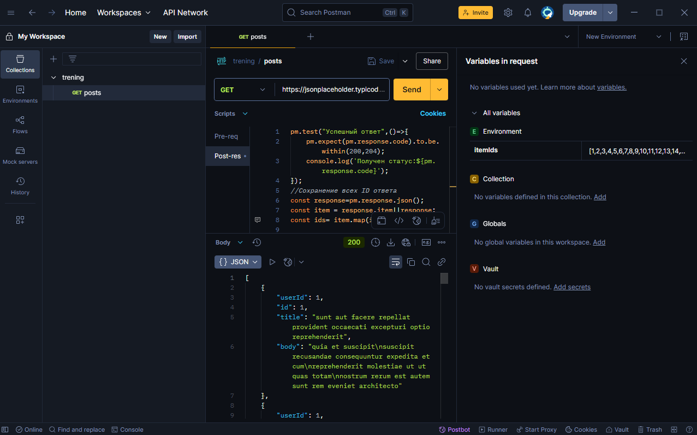
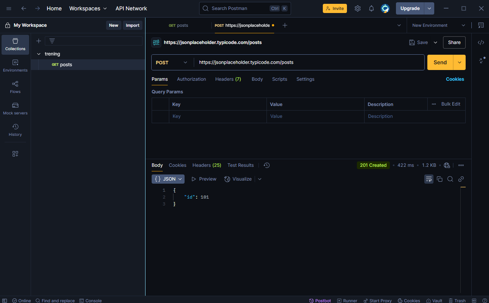
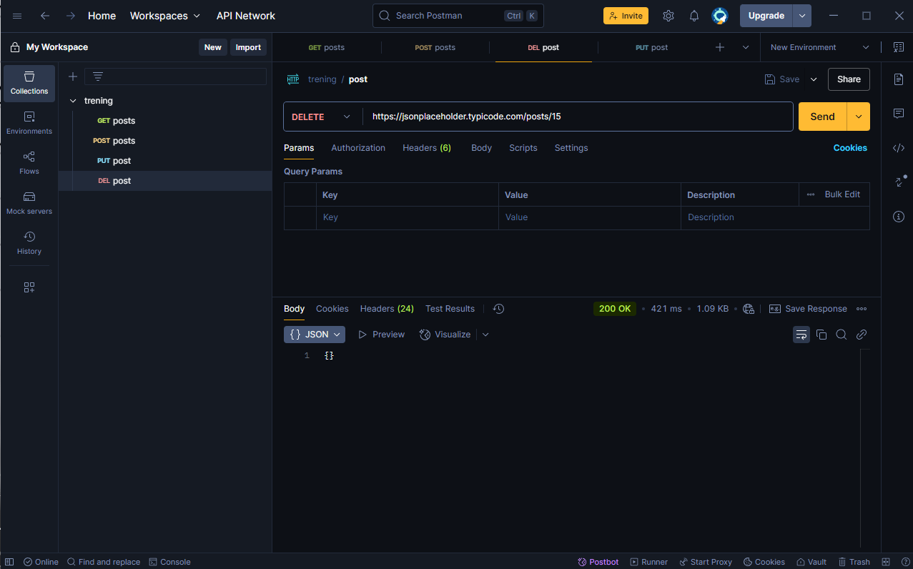

# API-PRACTICE 

Прохождение практики работы с API.В проекте использовались GET/POST/DEL/PUT звпросы для тестирования и логирования ответов от сервера 

---

## ПРИМЕРЫ API-запросов 

---

### Собственный JSON-файл

---

#### Заметки

**DEL-Удаленние данных**
**GET-запрос на получение данных**
**POST-Создание данных**
**PUT-Обновление данных**
**DEL-Удаление данных**

---

#### Скачивание моего репозитория

[скач zip](https://github.com/FiL4an/API-Practice)

