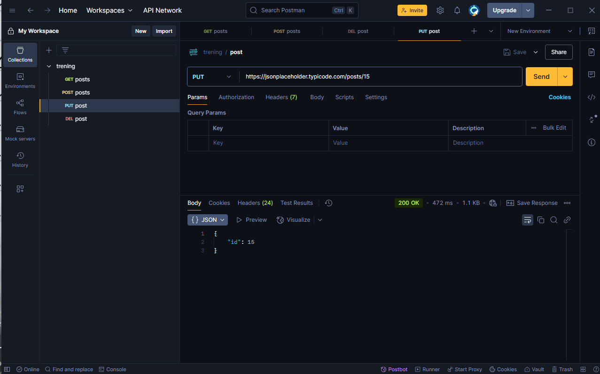

# API-PRACTICE 

Прохождение практики работы с API.В проекте использовались GET/POST/DEL/PUT звпросы для тестирования и логирования ответов от сервера 

---

## ПРИМЕРЫ API-запросов 

---

### Собственный JSON-файл

---

#### Заметки

- **DEL-Удаленние данных**
- **GET-запрос на получение данных**
- **POST-Создание данных**
- **PUT-Обновление данных**
- **DEL-Удаление данных**

---

#### Скачивание моего репозитория

[скач zip](https://github.com/FiL4an/API-Practice)

---

##### Что я узнал
- Как отправлять API-запросы с помощью методов GET/POST/PUT/DELETE
- Работать с языком JSON сделал свой фай
- узнал что такое http протокол
- Работал с инстурментом Postman
- Как оформит README.md  с помощью  Markdown
- Как пользоваться Git и GitHub: коммиты, ветки, пуши и пул-реквесты
